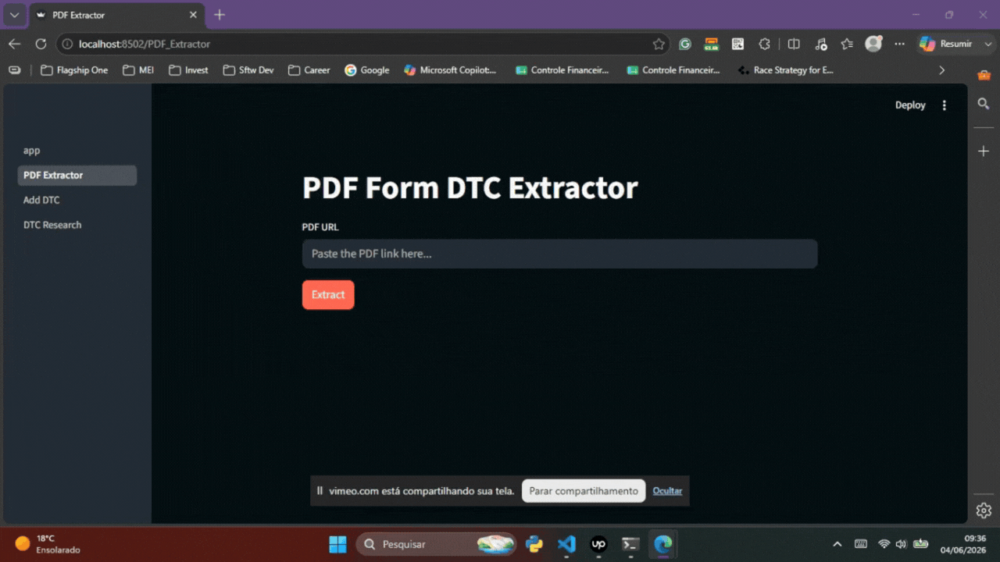

# 🔧 Automotive DTC Diagnostic Tool


## 📋 Project Description

A local Streamlit application that automates DTC (Diagnostic Trouble Code) extraction from RMA PDF forms via OCR, queries a local PostgreSQL database for code descriptions, and provides tools to manage and search DTCs across 33 automaker tables.

Built as a personal productivity tool for automotive diagnostics workflows, following professional Git and software development practices.

---

## ✨ Features

### 📄 Page 1 — PDF Form DTC Extractor
Paste a public PDF URL, and the app automatically:
- Extracts the automaker name from page 1 via OCR
- Extracts DTC codes from the Original Module and New Module fields
- Queries descriptions from the PostgreSQL database
- Displays results in a copyable output block
- Preserves results when navigating between pages (`st.session_state`)



---

### ➕ Page 2 — Add DTC
Two independent sections:

**Single DTC** — manually add one code at a time:
- Select automaker, enter DTC code and description
- Validates if code already exists before inserting

**Bulk Import from PDF** — upload a PDF file containing multiple DTCs:
- OCR extracts all `CODE Description` pairs from the file
- Displays a reviewable table with a checkbox column to skip unwanted codes
- Inserts only unchecked codes into the database

**Delete DTC** — remove a code from a specific automaker table


---

### 🔍 Page 3 — DTC Research
Search for a DTC code across all 33 automaker tables:
- Groups results by unique description
- Displays code + description in a copyable block
- Shows which tables the code was found in (separately, not copyable)


---

## 🛠️ Tech Stack

| Tool | Purpose |
|---|---|
| Python 3.14 | Core language |
| Streamlit | Multipage web UI |
| pytesseract | OCR engine wrapper |
| Tesseract-OCR | OCR binary (must be installed on OS) |
| pdf2image + Poppler | PDF to image conversion |
| psycopg2 | PostgreSQL connection |
| PostgreSQL | Local DTC database (33 automaker tables) |
| python-dotenv | Environment variable management |
| pandas | DataFrame manipulation for bulk import |
| requests | PDF download from URL |
| Pillow | Image processing |

---

## ⚙️ Installation & Execution

### Prerequisites
- Python 3.10+
- PostgreSQL running locally
- [Tesseract-OCR](https://github.com/UB-Mannheim/tesseract/wiki) installed on Windows
- [Poppler for Windows](https://github.com/oschwartz10612/poppler-windows/releases/) installed and added to PATH

### Setup

```bash
# Clone the repository
git clone https://github.com/Dev-Smart-Cat/automotive-dtc-diagnostic-tool.git
cd automotive-dtc-diagnostic-tool

# Create and activate virtual environment
python -m venv .venv
.venv\Scripts\activate

# Install dependencies
pip install -r requirements.txt
```

### Environment Variables
Create a `.env` file in the project root:
```
HOST_NAME=localhost
PORT_NUMBER=5432
DB_NAME=your_database
USER_NAME=your_user
PASSWORD=your_password
```

### Run
```bash
streamlit run app.py --server.port 8502
```

---

## 📁 Project Structure

```
automotive-dtc-diagnostic-tool/
│
├── app.py                    # Entry point — redirects to PDF Extractor page
├── utils.py                  # All business logic and DB functions
├── requirements.txt
├── .env                      # Not versioned — credentials
├── .gitignore
│
├── pages/
│   ├── 1_PDF_Extractor.py    # Page 1 — OCR extraction from PDF URL
│   ├── 2_Add_DTC.py          # Page 2 — Add, bulk import and delete DTCs
│   └── 3_DTC_Research.py     # Page 3 — Search DTC across all tables
│
├── notebooks/                # Not versioned — local testing only
│   ├── pdf-text-extract.ipynb
│   ├── add-dtcs.ipynb
│   └── dtc_search.ipynb
│
└── video/
    ├── 1_page.gif
    ├── 2_page.gif
    └── 3_page.gif
```

---

## 🗄️ Database Structure

Local PostgreSQL with 33 automaker-specific tables + 1 generic table.
Each table schema:

```sql
CREATE TABLE automaker_dtcs (
    id          SERIAL PRIMARY KEY,
    automaker   VARCHAR,
    code        VARCHAR,
    description TEXT
);
```

Supported automakers: Acura, Audi, BMW, Buick, Cadillac, Chevrolet, Chrysler, Dodge, Ford, Generic, Geo, GMC, Honda, Hyundai, Hummer, Infiniti, Isuzu, Jaguar, Jeep, Kia, Land Rover, Lexus, Mazda, Mercedes-Benz, Mini, Mitsubishi, Nissan, Oldsmobile, Pontiac, Saturn, Subaru, Toyota, Volkswagen.
